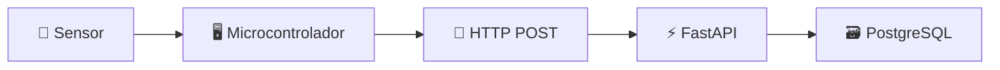
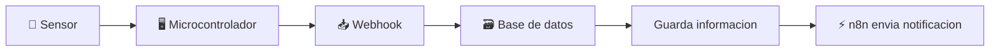
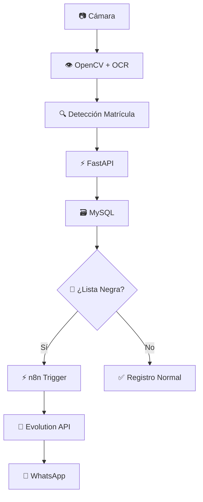

<div align="center">
  <h1>🚀 Curso: IA, Automatización y Python</h1>
  <h2>UTN-FRT - Ingeniería Electrónica</h2>
  <h3>8 Clases Intensivas • 16 horas totales • 30% teoría 70% práctica</h3>
  
  []()
  [![VSCode](https://img.shields.io/badge/_-Visual_Studio_Code-3776AB.svg?style=for-the-badge&logoSize=auto&logo=data:image/png;base64,iVBORw0KGgoAAAANSUhEUgAAACAAAAAgCAMAAABEpIrGAAAAAXNSR0IB2cksfwAAAAlwSFlzAAALEwAACxMBAJqcGAAAApdQTFRFAAAAYmJisLCw8fHx+/v76+vruLi4Xl5eaGhoYGBgwcHB9/f3////7OzsvLy8Xl5eZ2dnaGhoX19fysrK+vr67Ozsw8PDY2NjZmZmaWlpx8fH+/v77u7uvr6+XV1d1tbW/Pz85+fnZWVlXFxc3Nzc/v7+ZGRkbW1tZmZmXFxc29vba2trX19fx8fHvb29Xl5eZ2dnY2NjcXFx5+fn3d3d/f394uLidXV1ZmZmdnZ27Ozs8fHx2tra7+/vqKioYWFhY2NjkZGR7e3t4eHheXl5+Pj4xcXFXV1drq6u9PT0yMjIY2NjXV1d3t7e3t7epKSk9fX18vLyqKioXFxcWlpaXFxcZWVl29vb5OTkhYWFW1tbW1tbWlpaX19fysrKzc3NaGhoW1tbXl5eW1tbYmJiW1tbXFxcw8PD8vLyr6+vXFxcYGBgZGRkW1tbv7+/5ubmjo6OW1tbXFxcZGRkWlpa19fX8fHxra2tbGxsaGho2tra+vr6z8/PYGBga2trYmJibm5u5ubm5eXlkpKSYWFhdHR07Ozs9vb28PDwtra2ampq6enpurq6g4OD7u7u+fn5yMjI+fn57+/vm5ubW1tbe3t75ubm4+PjeHh4W1tbyMjI3d3deXl5WlpaXFxca2tr39/f7u7umJiYurq6w8PDYWFhWlpaW1tbZWVl29vb+fn5XFxclZWVk5OTXFxcW1tby8vLampqXV1dW1tbW1tbZ2dnXV1dxMTEwsLCW1tbsbGx+fn539/fW1tbXFxcqKio+fn52trak5OTZmZmW1tboaGh9PT01tbWlZWVXFxcWlpaZWVlWlpaj4+P7u7u2NjYkpKSXFxcW1tbYGBgX19fWlpahoaG3Nzc9PT01NTUjIyMW1tbW1tbmAVlHQAAAN10Uk5TAAZP7P/TYwkDBlr4/9xvCgMBBm7643gLAwGI/edKCpL/7AIKqP8BAQIMwAEHYGMIAQITyJv/tRgEJdjxs946BQQt5NFf9m4IOuijOTbNq1/y+HQnFygywdlPHyQTLrevNhkHJQQQKqb+fSkHAw+Q41chDQQYsfNmAwLA/5cLAgITyMkgByXW/u1JAeCWX+T9iv/sZSNE3b4hJpTKRR0LPNTmXIacMRYVNsP6IlNTEBO4AgkREgIqp48Ogv7eCyN1+dFHASBj9ctpLBUBHlrxwWEtGwQIG0/b/7lbGgzKgUBXAAAB6UlEQVR4nGNkwAIYoeAHiI1FnhMoB1X2AYsCQahWqEoMBZLvhBk/wnkCGAoEeRkZ3yDxRdEUKAHNfI7qYAYGNcabMJ4GI+MjdB9pgz10AcwxZESohSvgV2W8rsX4+h6QbcHIeAkmrn8RpsDm5XOw1oMMDoyMp2Dy5ownYApYOECUJSPjaTPGwzB5O0bGAzAFvvsh3tdkZNwDFXMFuWo7TEEY41YISwTmfR9GxvP3QjbCFMQwMq5DcXYwI+M5RiPGlTAFKUDj9iHCBqj+0+ODDNk/4AoYchj/skzjgHKTgcqXvWBgyP4At4KBoZiRcQPMiCzGb9wdDKgKKjcETkK4IB9oRBMDshX1jIzdKI4sY3w4h6HlPlxBK2MbhFXdChWqYWxoXKQPt6K7EUz/6GBkrIOKNTOWa+jAFUysBlFtjIfsGRnLYNZ0MzIWwxTMmn2dgaEf6LSVvN6MOTAVUxmzYAqSHW6sAjq07QqDfQYjYzJMxbwkmIIiYESuC550AMgutlkXHMOABhg3Ak2PXuYN5qT4MzPmPUdTAEyTXBdgvPp3z1Iz3qArQAYaE1eFMwYiCWxAzxcaU4FW+sC5WzFz1uHbaoyMbhD2bmxZj+F08DpGRjtgIlwFlF2QiCV3Cx6GZP73Qowda98DABMQd5ryIFUHAAAAAElFTkSuQmCC)](https://code.visualstudio.com/)
  [![Thonny](https://img.shields.io/badge/_-Thonny-yellow.svg?style=for-the-badge&logoSize=auto&logo=data:image/png;base64,iVBORw0KGgoAAAANSUhEUgAAAQAAAAEACAMAAABrrFhUAAAAAXNSR0IB2cksfwAAAAlwSFlzAAALEwAACxMBAJqcGAAAAMBQTFRFAAAA////////////////////////////////////////////////////////////////////////////////////////////////////////////////////////////////////////////////////////////////////////////////////////////////////////////////////////////////////////////////////////////A6PmTAAAAEB0Uk5TAAsbFm644fNtfOj/5y99u+L7pAX0+Pf5+v6maiUz7RT9/G+85K3KzKxsv371Le/q0SDWy3PmcHd4Gc2uHsN67gEWFG8AAAgRSURBVHic7Z3rb9RGFMXP7JIE0CpELCkhaUiTVaUSumqr9kM/tP3v+5JKkaqKFtEHCNFACeVR1JS2wbW9G5Pd2DP3MmN7xnMPaJOsvdczP9vHO/bMHYXIpdouQNsSAG0XoG11DIBK65Ok/xifqK0srShmAP2s9kcA+v/ikPaxTgBIK76Uvcy89d/fxM92QJ0EkNcnwavXmT+KVwzy4179czJCyuQRZTs+SJ2s1AGW83f1AHpQz6rDnvuNsmkfFBkANa3n5Me0tvm7hEqxtIJ7xsLM/1lymp18q/qU3FBI9rLfytcdZPU8mNQ2f8thbUs0TLdxR7+KACh+6yP307kzjwEg/XkaL9LqLGNJ4fnRkX5s3bS2qLG6ZbqIX/QrCICjX06fYn2FDkVr+Fm/wgTAMMGLBkrTgi7hJ/0KAiB/XX/aQFla0Rns61fIAGzgSSOFaUMCgABgKwGh1RSoKB6w86CZsrQiymUwegCj+82UpRVRvglGDkBhtNdMWVoQpTXYw/mDZkrTgig3RARAhwGs3zKv02EP2MAjym3x6AF09jL45k3Sal39JriJh7QGjgDoYmtQYfMH+roCoBM3RJaR4GWC5BmSrIMEsXcE/L4nmFfK9Cgqre+zJHul13lGAiB/9eG2+HJRW+tKcVQ8Gbpyt8knQ1ltp/twWlskDdS2RAKg+K2PBRy+zsPRvv6B5yoOXq1b+HQ7tS2Rgx4iu/qbLsYb0+1KANiHuIrbusXb+N5+G/VJANiHGGNf54IDeN3adABAYaWkn2ahs3hov436JABchLjwl2Zx9wH0sPpcs7j7HiAAYgcQvQcIAAEQOYDoTVAAxA4geg8QALEDqNUD+MPBuRuwD1EXgL5CMRy8D/JwcKYEgIsQdXjAaZyaOfDJw8GZEgAuQjgHMERS8rSaNh6eKT89YB3lHRYow8GZEgD2IdwD2Kjss0To/cyUhx6whaTyVB9CGfr/cyUAXIRwC2BHe85cNAyB4cpDDxhB13t7zTAKjCsBYB/CLQCFsXao3yXH/U0EgIsQLk1wjH1tr7MzhsHQXHkHwNDhRgB4CMCtBxg63fnoAU4BqBH0g9i6fhkMEYBTD+jt4lftCh5+FXYLYBW6w2kZix1vDIUIwK0HXICO5iIeM4KRNmgfQgA0CMD9g8bAPMB9ZwMB4CKEw87SIQIY6zPVdN8DogfgdMhMiACcjhoL0QMiB6BgaMAa87nNSAAEB6AHQwvemM9tRuGZYNoS0DdgF0353GbLIwBCA5C2BPQNWF77NTwPMAE4y9tlAiA4ACYPGPBKHJ4HCIDYAUTvAQIgdgDRe4AAiB1A9B4gAGIHEL0HCAABEDmA6E2wFQAnpzKceW106u3oATTtAX/kQ6qLSWrnAUyytjY593izABZxmfaotbmpt6MH0KwHcNTQ3OP+AgDeVrhuWkcA2G6kWQ9gahXncUN/Qeg2gFwJXmr8UADYhvfZAwq9g+svKxYJANvYCivQdhX2AUBajC18U7rAGoCho6wHHnCkXahrJy8IAsA2rGmo6zYvuX6NAFDaQrAG4Hioa10eUGi+hSAALOO5HupaO4D5bEy2AFwPda3XAyZ6F18f26BlMAHgeKhrEwBWsYavig1aBosegOuhrg2YYK4lNZ1ms2YA7EdZTQHAOUwuBgLAMo7rZ3lNeMBUK3lqwogBDHbwpQCI1wNSvYcvwgbwRrblYw9Hz7A7T6Q2IAC4n5lTax6gNjE/vTZ/8uChEgAhAtjGzap5a7mTB18M0APex+eapX0s7GJPPxHwMa0JgOAAFM04XRB88CNtc5dC8wBy8/oK7lLMYFsABAaAcUr1P0Ryw7TSIDQPYAL9GPf1BTgrAKwBGB6Otwsguyur7TEqAKwBjA0Px9szwYl6uKz7hL0JXr2tXcyeet49AEO2RwHAi3dCu4aH46w8Wqjhe4Up26MdAIWx/uk3L40UBEBoAMbY1zc8eXm0EJwHmHpIMdNIQQCEBsDUQ2r0HTdiYB4QO4AaZkMIC0ANsyGE5QECwP1sCGEBqGEygLA8QAC4z3YQFoAash2E5QECQABEDiAIEzTM/9F1AJ/ox48LgM57gOGWTfdN8FN8q1ts2T8gegDee4DCR9B2krDsI+Q9gB628LtuBcteYtED8N4DPsM1/QqWPUUFQOMAePdYtt6qSBtxpOXF0DwAuMC4zbhj2gGLjwWAdwBc3mkf3TesMHjgnwe4e9hk7LyQ5/cQANRwZaojBay7lBzG3ht5MN88wGFWGlMk5IeTAKCGK1MdANIDVzvghZ6YyXQyIb+kCABquDLVYYLOkrMZrycYQt3xEYCj9HzGr1Qp6XuWg6ejB1CHBzhL0WlsVazfyl67C8BQuFX8mY8/FADkkpXIaw8g7p3uAiAWTgBQC1Ymrz1AAMQOIHoTFABNANB/3WYPGswU1lVA3+JkDxrM5M4EaXtHAFALVqoRdI8e2IMGM/VgKDj1tCLuHTsAO1qbYw8azKRgKDj5qKLtHQFADVeqLSTVSX2GijtocCJDwcmnFW3vCABquAptPKlcNElaypeh4OTTirZ3rNPrr+Np6ftHaWv50hU8v5NNFmXvCAB6uHINUZbGcAmEnGeVqi54fiebLsLesQaQaS6NocLmfLJHpioLzjyqCHtHAPAiVqiPhcN8FlAkSfafON9npdKCl2QHpc2gOC/D3nEDoAbN58N7/cNKv3cEwOsWsH71F3A4nWE4K7n1eVUuAVBL1IAkANouQNsSAG0XoG39D3rNATzGPXF+AAAAAElFTkSuQmCC)](https://thonny.org/)
  [](https://www.python.org/)
  [](https://micropython.org/)
  [](https://www.raspberrypi.com/products/raspberry-pi-pico-2/)
  [](https://www.espressif.com/en/products/socs/esp32)
  [](https://github.com/)
</div>
  
Aqui encontrarás el material del curso **Introducción a Python y Micropython** dictado en la UTN-FRT por el instructor **Maximiliano Simonazzi**.

## 📊 Información del Curso

### ⏱️ **Duración**
- **Total de clases**: 8 de 2 horas cada una
- **Total**: 16 horas intensivas

### 📈 **Metodología**
- **30%** 📖 Teoría conceptual
- **70%** 💻 Práctica hands-on

### 🎯 **Perfil**
Al finalizar el curso, entenderas conceptos claves en el desarrollo y despliegue de sistemas completos:

- 🐳 **Containerización** con Docker y Docker Compose
- 🗃️ **Bases de Datos** con MySQL
- ⚡ **APIs REST** con FastAPI  
- 🤖 **IA Local** con Ollama
- ⚡ **Automatización** con n8n
- 👁️ **Computer Vision** con OpenCV
- 🔄 **Integración** de sistemas completos
## 📋 Índice del Curso

| Clase | Tema | Duración | Tecnologías |
|-------|------|----------|-------------|
| **1** | [🐳 Virtualización y Contenedores](#-clase-1--virtualización-y-contenedores) | 2h | VirtualBox, Docker |
| **2** | [🔧 Docker Compose](#-clase-2--docker-compose) | 2h | Docker Compose, MySQL, NginX, webDB |
| **3** | [🗃️ Fundamentos de SQL](#️-clase-3--fundamentos-de-sql) | 2h | SQL, MySQL |
| **4** | [🌐 APIs con FastAPI](#-clase-4--creación-y-consumo-de-apis-con-python-fastapi) | 2h | Python, FastAPI, IoT |
| **5** | [⚡ Automatización con n8n](#-clase-5--automatización-con-n8n) | 2h | n8n, Workflows |
| **6** | [🤖 IA con Ollama](#-clase-6--introducción-a-ollama-y-modelos-de-ia) | 2h | Ollama, LLM |
| **7** | [👁️ Visión por Computadora](#️-clase-7--visión-por-computadora-con-python) | 2h | OpenCV, OCR |
| **8** | [🎯 Proyecto Integrador](#-clase-8--proyecto-integrador-sistema-de-alerta-automática) | 2h | Integración completa |

---

## 🐳 Clase 1 – Virtualización y Contenedores

### **Conceptos importantes**
- **Virtualización**: Concepto de virtualización y diferencias con contenedores
- **MV vs Docker**: Rendimiento, escalabilidad, casos de uso
- **Docker Básico**: Instalación y comandos fundamentales

### **Ejercicio Práctico**
> **Objetivo**: Ejecutar contenedores básicos
> - 🐧 Ubuntu
> - 🐍 Python  
> - 🌐 Nginx

---

## 🔧 Clase 2 – Docker Compose

### **Conceptos importantes**
- **Arquitectura**: Estructura de `docker-compose.yml`
- **Conceptos**: Redes, volúmenes, dependencias entre servicios
- **Servicios**: Despliegue multiple de servicios (Nginx, MySQL, uvicorn, webDB, etc) como contenedores

### **Ejercicio Práctico**
> **Stack Completo**: Desplegar en un solo paso todo el stack
> 
> ```yaml
> services:
>   - 🐍 Python App
>   - 🐘 MySQL DB  
>   - 🖥️ webDB
> ```

---

## 🗃️ Clase 3 – Fundamentos de SQL

### **Conceptos importantes**
- **Estructura**: Tablas, filas, columnas
- **Lenguajes**: DDL (definición) y DML (manipulación)
- **Definición de Datos (DDL)**. Crear base de datos, crear tabla, etc.
- **Tipos de Datos**: INT, VARCHAR, DATE, FLOAT, etc.
- **Manipulación de Datos (DML)**: INSERT, SELECT, WHERE, UPDATE, etc.


### **Ejercicio Práctico**
> **Base de Datos**: `curso_iot`
> 
> **Tabla `sensores`**:
> - `id` (identificador)
> - `nombre` (nombre del sensor)
> - `ubicacion` (ubicacion del sensor)
> - `tipo` (tipo del sensor)
> - `serial` (numero de serie)
>
> **Tabla `mediciones`**:
> - `id` (identificador)
> - `id_sensor` (identificador del sensor FK)
> - `fecha` (timestamp)
> - `temperatura` (float)
> - `humedad` (float)
> 
> #### **🔍 Consultas a Realizar**:
> - ✅ Todas las filas
> - 🔥 Temperaturas > 30°C
> - 📈 Promedio de humedad
> - ⏰ Registros en rango horario
> - 🔌 Mediciones de un sensor determinado

---

## 🌐 Clase 4 – Creación y Consumo de APIs con Python (FastAPI)

### **Conceptos importantes**
- **APIs REST**: Principios y arquitectura
- **FastAPI**: Endpoints, validación, documentación automática
- **Integración**: Conexión con una base de datos
- **IoT**: Introducción a la captura de datos con microcontroladores usando MicroPython (ESP32/ESP8266, Raspberry Pi Pico W)

### 🎯 **Ejercicio Práctico:**

> **Flujo de Datos**:
> 1. 🔌 Sensor → 🖥️ Microcontrolador
> 1. 🖥️ Microcontrolador → HTTP POST
> 2. ⚡ FastAPI → procesa datos
> 3. 🗃️ MySQL → almacena información



---

## ⚡ Clase 5 – Automatización con n8n

### **Conceptos importantes**
- **Low-Code Automation**: Concepto de n8n
- **Workflows**: Nodos, conectores y triggers
- **Despliegue**: n8n en Docker
- **Integración**: Base de datos y servicios externos

### 🎯 **Ejercicio Práctico: Workflow Automatizado**
> **Flujo Completo**:
> 1. 🔌 Sensor → 🖥️ Microcontrolador
> 1. 🖥️ Microcontrolador → Webhook
> 1. 📥 Webhook → Base de Datos
> 2. 🗃️ Base de Datos → guarda la informacion
> 3. 📱 n8n → envía notificación si temperatura supera umbral por whatsapp



---

## 🤖 Clase 6 – Introducción a Ollama y Modelos de IA

### **Conceptos importantes**
- **Ollama**: Modelos LLM ejecutados localmente
- **Docker**: Instalación y despliegue
- **APIs REST**: Consumo desde Python
- **Casos de Uso**: Resúmenes, análisis, chat

### **Ejercicio Práctico**
> **Chat con IA Local**:
> 
> Desarrollar script Python que:
> - 🔌 Se conecta a Ollama
> - 💬 Permite conversación interactiva por chat y por voz
> - 🤖 Integrar un agente con n8n

---

## 👁️ Clase 7 – Visión por Computadora con Python

### **Conceptos importantes**
- **OpenCV**: Procesamiento y análisis de imágenes
- **OCR**: Reconocimiento óptico de caracteres (EasyOCR/Tesseract)
- **Detección**: Bordes y objetos con OpenCV
- **OCR**: Extracción de texto de imágenes
- **Dataset**: Matrículas recortadas para práctica

### **Ejercicio Práctico**
> **Detector de Matrículas**:
> 
> 1. 📷 Procesamiento de imagen
> 2. 📝 Extracción de texto (matrícula)
> 3. 📤 Envío a API similar a Clase 4

---

## 🎯 Clase 8 – Proyecto Integrador: Sistema de Alerta Automática

### 🏆 **Objetivo Principal**
> **"Detector de Matrículas con Alarma vía WhatsApp"**

### 🔄 **Flujo del Sistema Completo**



### 🛠️ **Arquitectura de Despliegue**
```yaml
Docker Compose Stack:
  - 🗃️ MySQL Database
  - ⚡ FastAPI Backend  
  - 📱 Evolution API
  - ⚡ n8n Automation
  - 👁️ Computer Vision Service
```

### ✅ **Entregables Finales**

Para aprobar el curso, cada alumno debe entregar el proyecto funcionando end-to-end, incluyendo:

- 🐳 **Containerización**: Todo en Docker Compose
- 🔄 **Pipeline**: Funcionamiento end-to-end completo (backend, base de datos, agente, etc)
- 📚 **Documentación**: API y workflow completos

---

