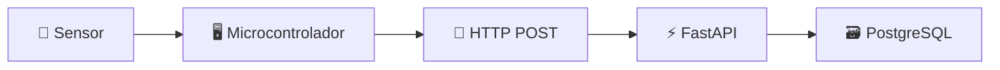
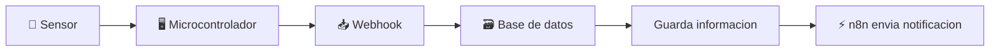
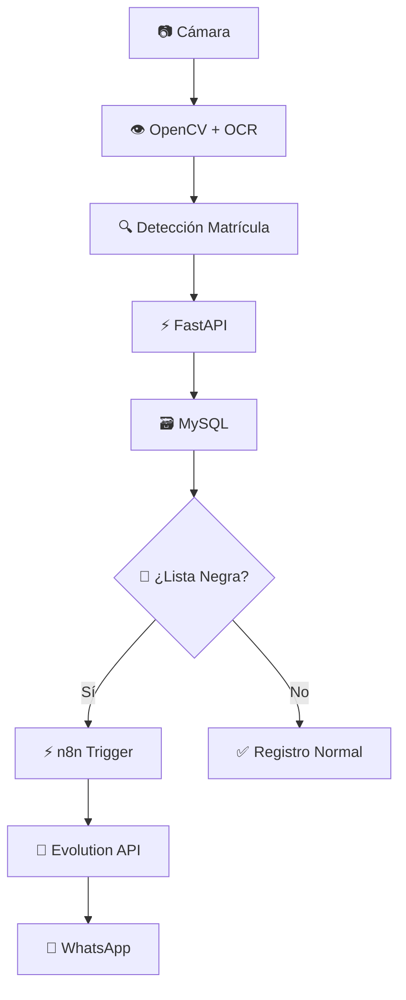

# 🚀 Curso: IA, Automatización y Python
> **8 Clases Intensivas** • 16 horas totales • 30% teoría 70% práctica

## 📊 Información del Curso

### ⏱️ **Duración**
- **Total de clases**: 8 de 2 horas cada una
- **Total**: 16 horas intensivas

### 📈 **Metodología**
- **30%** 📖 Teoría conceptual
- **70%** 💻 Práctica hands-on

### 🎯 **Perfil**
Al finalizar el curso, entenderas conceptos claves en el desarrollo y despliegue de sistemas completos:

- 🐳 **Containerización** con Docker y Docker Compose
- 🗃️ **Bases de Datos** con MySQL
- ⚡ **APIs REST** con FastAPI  
- 🤖 **IA Local** con Ollama
- ⚡ **Automatización** con n8n
- 👁️ **Computer Vision** con OpenCV
- 🔄 **Integración** de sistemas completos
## 📋 Índice del Curso

| Clase | Tema | Duración | Tecnologías |
|-------|------|----------|-------------|
| **1** | [🐳 Virtualización y Contenedores](#-clase-1--virtualización-y-contenedores) | 2h | VirtualBox, Docker |
| **2** | [🔧 Docker Compose](#-clase-2--docker-compose) | 2h | Docker Compose, MySQL, NginX, webDB |
| **3** | [🗃️ Fundamentos de SQL](#️-clase-3--fundamentos-de-sql) | 2h | SQL, MySQL |
| **4** | [🌐 APIs con FastAPI](#-clase-4--creación-y-consumo-de-apis-con-python-fastapi) | 2h | Python, FastAPI, IoT |
| **5** | [⚡ Automatización con n8n](#-clase-5--automatización-con-n8n) | 2h | n8n, Workflows |
| **6** | [🤖 IA con Ollama](#-clase-6--introducción-a-ollama-y-modelos-de-ia) | 2h | Ollama, LLM |
| **7** | [👁️ Visión por Computadora](#️-clase-7--visión-por-computadora-con-python) | 2h | OpenCV, OCR |
| **8** | [🎯 Proyecto Integrador](#-clase-8--proyecto-integrador-sistema-de-alerta-automática) | 2h | Integración completa |

---

## 🐳 Clase 1 – Virtualización y Contenedores

### **Conceptos importantes**
- **Virtualización**: Concepto de virtualización y diferencias con contenedores
- **MV vs Docker**: Rendimiento, escalabilidad, casos de uso
- **Docker Básico**: Instalación y comandos fundamentales

### **Ejercicio Práctico**
> **Objetivo**: Ejecutar contenedores básicos
> - 🐧 Ubuntu
> - 🐍 Python  
> - 🌐 Nginx

---

## 🔧 Clase 2 – Docker Compose

### **Conceptos importantes**
- **Arquitectura**: Estructura de `docker-compose.yml`
- **Conceptos**: Redes, volúmenes, dependencias entre servicios
- **Servicios**: Despliegue multiple de servicios (Nginx, MySQL, uvicorn, webDB, etc) como contenedores

### **Ejercicio Práctico**
> **Stack Completo**: Desplegar en un solo paso todo el stack
> 
> ```yaml
> services:
>   - 🐍 Python App
>   - 🐘 MySQL DB  
>   - 🖥️ webDB
> ```

---

## 🗃️ Clase 3 – Fundamentos de SQL

### **Conceptos importantes**
- **Estructura**: Tablas, filas, columnas
- **Lenguajes**: DDL (definición) y DML (manipulación)
- **Definición de Datos (DDL)**. Crear base de datos, crear tabla, etc.
- **Tipos de Datos**: INT, VARCHAR, DATE, FLOAT, etc.
- **Manipulación de Datos (DML)**: INSERT, SELECT, WHERE, UPDATE, etc.


### **Ejercicio Práctico**
> **Base de Datos**: `curso_iot`
> 
> **Tabla `sensores`**:
> - `id` (identificador)
> - `nombre` (nombre del sensor)
> - `ubicacion` (ubicacion del sensor)
> - `tipo` (tipo del sensor)
> - `serial` (numero de serie)
>
> **Tabla `mediciones`**:
> - `id` (identificador)
> - `id_sensor` (identificador del sensor FK)
> - `fecha` (timestamp)
> - `temperatura` (float)
> - `humedad` (float)
> 
> #### **🔍 Consultas a Realizar**:
> - ✅ Todas las filas
> - 🔥 Temperaturas > 30°C
> - 📈 Promedio de humedad
> - ⏰ Registros en rango horario
> - 🔌 Mediciones de un sensor determinado

---

## 🌐 Clase 4 – Creación y Consumo de APIs con Python (FastAPI)

### **Conceptos importantes**
- **APIs REST**: Principios y arquitectura
- **FastAPI**: Endpoints, validación, documentación automática
- **Integración**: Conexión con una base de datos
- **IoT**: Introducción a la captura de datos con microcontroladores usando MicroPython (ESP32/ESP8266, Raspberry Pi Pico W)

### 🎯 **Ejercicio Práctico:**

> **Flujo de Datos**:
> 1. 🔌 Sensor → 🖥️ Microcontrolador
> 1. 🖥️ Microcontrolador → HTTP POST
> 2. ⚡ FastAPI → procesa datos
> 3. 🗃️ MySQL → almacena información



---

## ⚡ Clase 5 – Automatización con n8n

### **Conceptos importantes**
- **Low-Code Automation**: Concepto de n8n
- **Workflows**: Nodos, conectores y triggers
- **Despliegue**: n8n en Docker
- **Integración**: Base de datos y servicios externos

### 🎯 **Ejercicio Práctico: Workflow Automatizado**
> **Flujo Completo**:
> 1. 🔌 Sensor → 🖥️ Microcontrolador
> 1. 🖥️ Microcontrolador → Webhook
> 1. 📥 Webhook → Base de Datos
> 2. 🗃️ Base de Datos → guarda la informacion
> 3. 📱 n8n → envía notificación si temperatura supera umbral por whatsapp



---

## 🤖 Clase 6 – Introducción a Ollama y Modelos de IA

### **Conceptos importantes**
- **Ollama**: Modelos LLM ejecutados localmente
- **Docker**: Instalación y despliegue
- **APIs REST**: Consumo desde Python
- **Casos de Uso**: Resúmenes, análisis, chat

### **Ejercicio Práctico**
> **Chat con IA Local**:
> 
> Desarrollar script Python que:
> - 🔌 Se conecta a Ollama
> - 💬 Permite conversación interactiva por chat y por voz
> - 🤖 Integrar un agente con n8n

---

## 👁️ Clase 7 – Visión por Computadora con Python

### **Conceptos importantes**
- **OpenCV**: Procesamiento y análisis de imágenes
- **OCR**: Reconocimiento óptico de caracteres (EasyOCR/Tesseract)
- **Detección**: Bordes y objetos con OpenCV
- **OCR**: Extracción de texto de imágenes
- **Dataset**: Matrículas recortadas para práctica

### **Ejercicio Práctico**
> **Detector de Matrículas**:
> 
> 1. 📷 Procesamiento de imagen
> 2. 📝 Extracción de texto (matrícula)
> 3. 📤 Envío a API similar a Clase 4

---

## 🎯 Clase 8 – Proyecto Integrador: Sistema de Alerta Automática

### 🏆 **Objetivo Principal**
> **"Detector de Matrículas con Alarma vía WhatsApp"**

### 🔄 **Flujo del Sistema Completo**



### 🛠️ **Arquitectura de Despliegue**
```yaml
Docker Compose Stack:
  - 🗃️ MySQL Database
  - ⚡ FastAPI Backend  
  - 📱 Evolution API
  - ⚡ n8n Automation
  - 👁️ Computer Vision Service
```

### ✅ **Entregables Finales**

Para aprobar el curso, cada alumno debe entregar el proyecto funcionando end-to-end, incluyendo:

- 🐳 **Containerización**: Todo en Docker Compose
- 🔄 **Pipeline**: Funcionamiento end-to-end completo (backend, base de datos, agente, etc)
- 📚 **Documentación**: API y workflow completos

---

